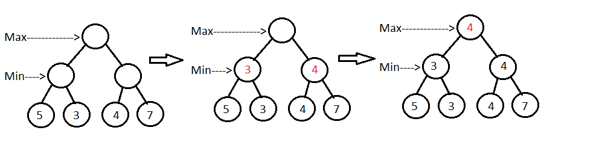
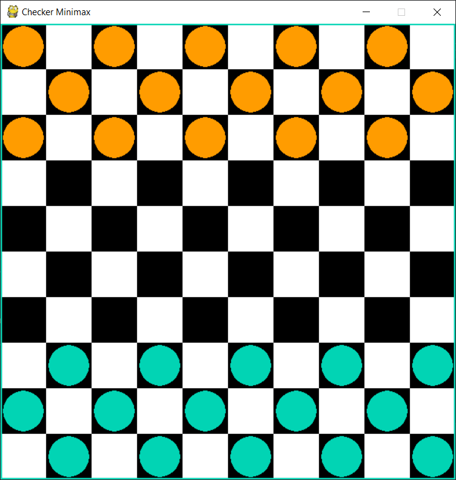
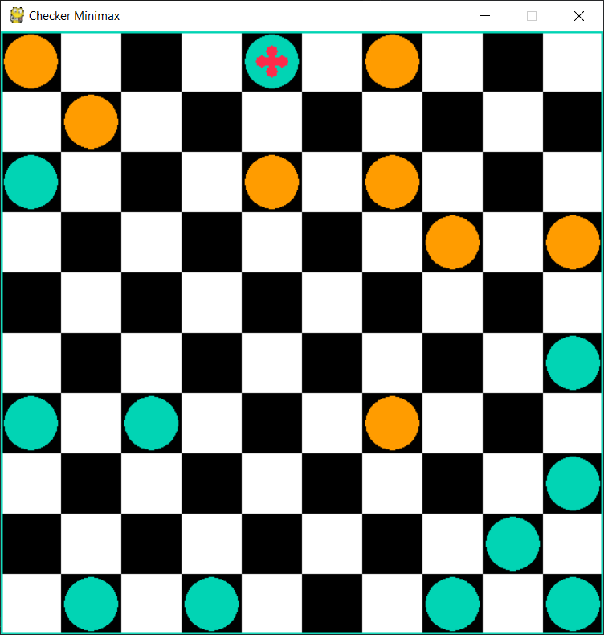

# checkers-minimax
AI for checkers using minimax algorithm.

In this project the popular board game of *Checkers* has been designed and implemented by using the Pygame framework. The game follows the rules of International Draughts, which is played on a 10x10 checkerboard. The Artifial Intelligence (AI) implemented in the opponent uses the classic Minimax algorithm with a custom evaluation function in which the game board is evaluated with a score. The evaluation function is the core of the algorithm and the better is designed, the more intelligent the AI will be, and consequently harder to beat.

## Aim of the project:
The aim of the project was not to create the perfect AI, but rather to investigate how powerful this algorithm can be in a popular 2 players game with an average knowledge of its strategies and tacticts. The minimax algorithm at the current stage has been proposed in its raw form without Alpha-Beta pruning. Regarding the evaluation function, all the criteria and metrics implemented follow my judgement and understanding of the game, no ispiration from other projects was taken in order to be more challenging for myself.

## Minimax algorithm explanation:
The main concept around which the minimax algorithm gravitates, is the assumption of facing an intelligent opponent who is always playing in his interest. Starting on our turn we build the decision tree, every branch corresponds to a move that we make that leads to a different state (i.e. a different game board configuration). On the opponent's turn, from each of the states that we develop, new branches are created, one for every possible opponent's move, and so on. 

Given a fixed height of the tree (i.e. number of moves we want to look ahead), we now want to assign a value to each node, representing the score that the player, playing at that turn, is getting. Starting from the bottom of the tree (and supposing its our turn) by means of an evaluation function we assign to the board state we are considering a value, which can be positive (good for us) of negative (bad for us). 

After all the leafs of the tree have been assigned values, we trace back to each parent state (which will fall under the opponent's turn) and we choose the lowest value from all childs (by assumption the opponent wants to minimize our score). Tracing back another time we end up in our turn, and we choose the maximum value from the ones choosen by the opponents, in order to maximize our score. 

By repeating this procedure we go back to the initial state with the best score we can get knowing the opponent is smart and trying to counteract our winning strategy to get us the lowest value. Using this decision strategy for every move will bring us (hopefully) to win.

## Evaluation function implementation:
There are 2 critical parts for this algorithm to work properly:
- Large enough tree's height;
- Well thought and designed evaluation function;

The first part is critical for a time complexity kind of problem (being the search of the decision tree a NP-hard problem). Potentially, being checkers a finite moves game, we could search the entire tree in order to choose always the move that gets us to a winning state, but that's obviously unfeasable and so we have to use trees of fixed height and rely on the use of an evaluation function that teels us accurately how much a state in favorable to us (even though it is not a final one).

The second part is critical because the intelligence of our AI relies on the criteria and metrics that we choose to implement. By randomly guessing the goodness of the states, this algorithm is no better than playing while blindfolded. So, in order to design an evaluation function, a deep knowledge about the game is required.

With the premises explained before, my implementation of the evaluation function for checkers works as follows:
1) If a state is a final one, if we win return +1000, if we lose return -1000;
2) Otherwise initializate a variable to 0, sum rewards or penalties according to various criteria and then return the sum.

<b>List of rewards (for pieces on our side):</b>

<table>
<tbody>
<tr>
  <td><b>For every king alive</b></td>
<td>+ 100</td>
</tr>
<tr>
<td><b>For every piece alive</b></td>
<td>+ 20</td>
</tr>
<tr>
  <td><b>How close to the wall</b></td>
<td>+ (y_coord/10)*10</td>
</tr>
<tr>
  <td><b>How close to the sides</b></td>
<td>+ (1-(0.5/abs(x_coord-5.5)))*20</td>
</tr>
</tbody>
</table>

<b>List of penalties (for pieces on opponent's side):</b>

<table>
<tbody>
<tr>
  <td><b>For every king alive</b></td>
<td>- 100</td>
</tr>
<tr>
<td><b>For every piece alive</b></td>
<td>- 20</td>
</tr>
<tr>
  <td><b>How close to the wall</b></td>
<td>- ((10-y_coord)/10)*10</td>
</tr>
<tr>
  <td><b>How close to the sides</b></td>
<td>- (1-(0.5/abs(x_coord-5.5)))*20</td>
</tr>
</tbody>
</table>
   
With these simple rules the AI has a sort of understanding of how a beginner could play by keeping into account just the number of his pieces and kings and their position in relation to the board. This however does not take into account formations (position of pieces in relation to each other) nor more advanced strategies (e.g. force the opponent into a forced eating move).

## Contacts:
If you have any issues and/or questions don't hesitate to contact me at the e-mail address provided below. This was just a fun project and any suggestions to improve the AI will be welcomed as well.

lorenzo.gualniera@gmail.com

## Screenshots:

